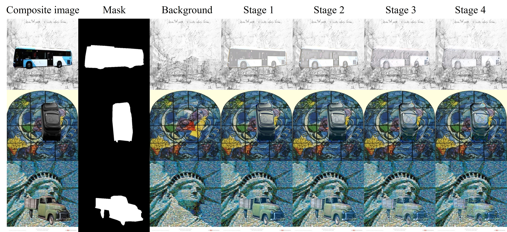

# ProPIH-Painterly-Image-Harmonization


We release the code used in the following paper:
> **Progressive Painterly Image Harmonization from Low-level Styles to High-level Styles**  [[arXiv]](https://arxiv.org/pdf/2312.10264.pdf)<br>
>
> Li Niu, Yan Hong, Junyan Cao, Liqing Zhang
>
> Accepted by AAAI 2024

Our method can harmonize a composite image from low-level styles to high-level styles. The results harmonized to the highest style level have sufficiently stylized foregrounds, but also take the risk of content distortion and artifacts. The users can select the result harmonized to the proper style level. 

## Online Demo

Try this [online demo](http://libcom.ustcnewly.com/) for image composition (object insertion) built upon [libcom](https://github.com/bcmi/libcom) toolbox and have fun!

[![]](https://github.com/user-attachments/assets/87416ec5-2461-42cb-9f2d-5030b1e1b5ec)

## Prerequisites
- Linux
- Python 3.9
- PyTorch 1.10
- NVIDIA GPU + CUDA

## Getting Started
### Installation
- Clone this repo:

```bash
git clone https://github.com/bcmi/ProPIH-Painterly-Image-Harmonization.git
```

- Prepare the datasets as in [PHDNet](https://github.com/bcmi/PHDNet-Painterly-Image-Harmonization/).

- Install PyTorch and dependencies:

```bash
conda create -n ProPIH python=3.9
conda install pytorch==1.10.1 torchvision==0.11.2 torchaudio==0.10.1 cudatoolkit=11.3 -c pytorch -c conda-forge
```

- Install python requirements:

```bash
pip install -r requirements.txt
```

- Download pre-trained VGG19 from [Baidu Cloud](https://pan.baidu.com/s/1HljOE-4Q2yUeeWmteu0nNA) (access code: pc9y) or [Dropbox](https://www.dropbox.com/scl/fi/xe7pqh840enc16wq5f00r/vgg_normalised.pth?rlkey=c09ynaraeir01b1xsrxwmmfqg&st=tsvcikom&dl=0). Put it in  `./<checkpoints_dir>/pretrained`

### ProPIH train/test
- Train ProPIH: 

Modify the `content_dir` and `style_dir` to the corresponding path of each dataset in `train.sh`.

```bash
cd scripts
bash train.sh
```

The trained model would be saved in `./<checkpoints_dir>/<name>/`. If you want to load a model and resume training, add `--continue_train` and set the `--epoch XX` in `train.sh`. It would load the model `./<checkpoints_dir>/<name>/<epoch>_net_G.pth`.
For example, if the model is saved in `./AA/BB/latest_net_G.pth`, the `checkpoints_dir` should be `../AA/`, the `name` should be `BB`, and the `epoch` should be `latest`.

- Test ProPIH:


Our pre-trained model is available in [Baidu Cloud](https://pan.baidu.com/s/1CDSnqzlcLKZGD7fzIFp5Qg) (access code: azir) or [Dropbox](https://www.dropbox.com/scl/fi/hs3cpdrjsojpy9s8z0nb2/latest_net_G.pth?rlkey=gyd9c3tlj5k7e6qufcxxdvzq8&st=bigeqodb&dl=0). Put it in `./<checkpoints_dir>/pretrained`. We provide some test examples in `./examples`. 

```bash
cd scripts
bash test.sh
```
The output results would be saved in `./output`. Some results are shown below. We can see that from stage 1 to stage 4, the composite images are harmonized progressively from low-level styles (color, simple texture) to high-level styles (complex texture). 

<div align="center">
	
</div>

## Other Resources

+ [Awesome-Image-Harmonization](https://github.com/bcmi/Awesome-Image-Harmonization)
+ [Awesome-Image-Composition](https://github.com/bcmi/Awesome-Object-Insertion)
